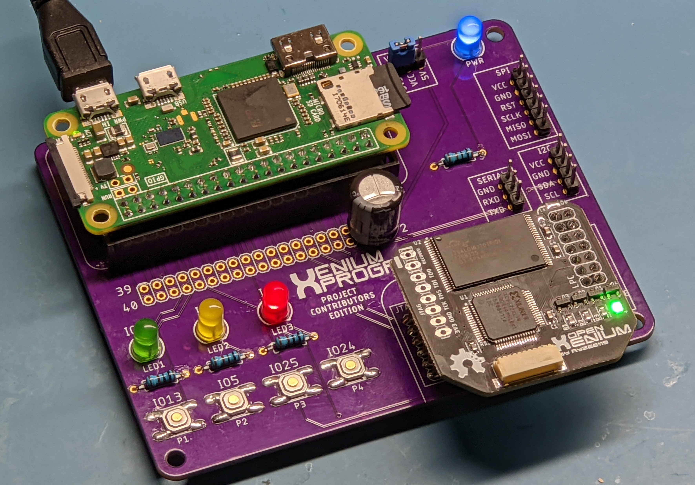
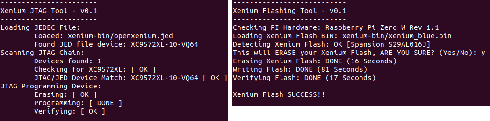
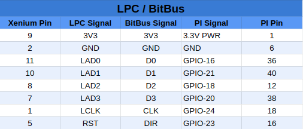
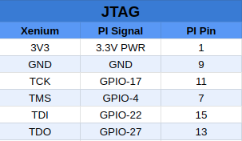
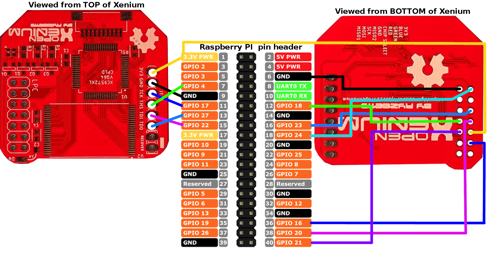

# OpenXenium JTAG and Flash Memory programmer

The tools in this repo will allow you to use a Raspberry PI or an Onion Omega2+ to program an OpenXenium chip with the Xilinx CPLD Firmware via JTAG and will also upload XeniumOS images into the OpenXenium Flash memory via a custom 4-bit bus NOR Flash programming protocol. 

** Read the [XBOX BIOS INJECTION](XBOX.md) write up for gory details **

### Raspberry PI:
- This has only been tested on PI Zero W and PI 3B+ models so far.

https://www.pishop.us/product/raspberry-pi-zero-w/

### Onion Omega2+:
- This has been tested and works on the Onion Omega2+.

https://Onion.io/store/omega2p

-------------
## INSTALLING THE XENIUM PROGRAMMER

- Clone this repo by running: `git clone https://github.com/kooscode/xenium-programmer.git`
- Then run: `./install`

## UPDATING XENIUM PROGRAMMER

- Pull the latest code with: `git pull`
- Then run: `./install` 

-------------
## PROGRAMMING A XENIUM CPLD AND FLASH MEMORY

- You can program XeniumOS and OpenXenium Firmware in one single step.
- Run: `./xenium-programmer`  

-------------
## HOOKING UP THE HARDWARE

- The JTAG and FLASH pins are configurable by editing the `XeniumDefines.h` file 
- If you edited the `XeniumDefines.h` file, make sure to run `./install` again

## [ RASPBERRY PI ]
    

## [ ONION OMEGA2+ ]

###  [ IMAGES COMING SOON ]
 
 The Onion Omega2+ Pinouts are in the `XeniumDefines.h` file.. I'll add images soon..

-------------
## CREDITS

- Koos du Preez - Creator (kdupreez@hotmail.com - Comments, improvements, critique, etc. is welcome!)
- Ryzee119 -  OpenXenium Firmware and hardware and all round awesomeness!
- XC3SPROG - Not sure who to thank here, but the source code was pivotal in making this work!
