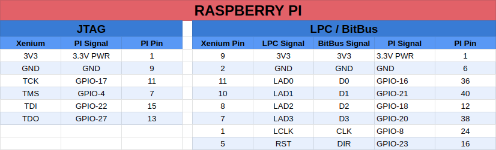
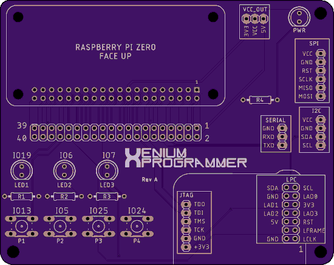
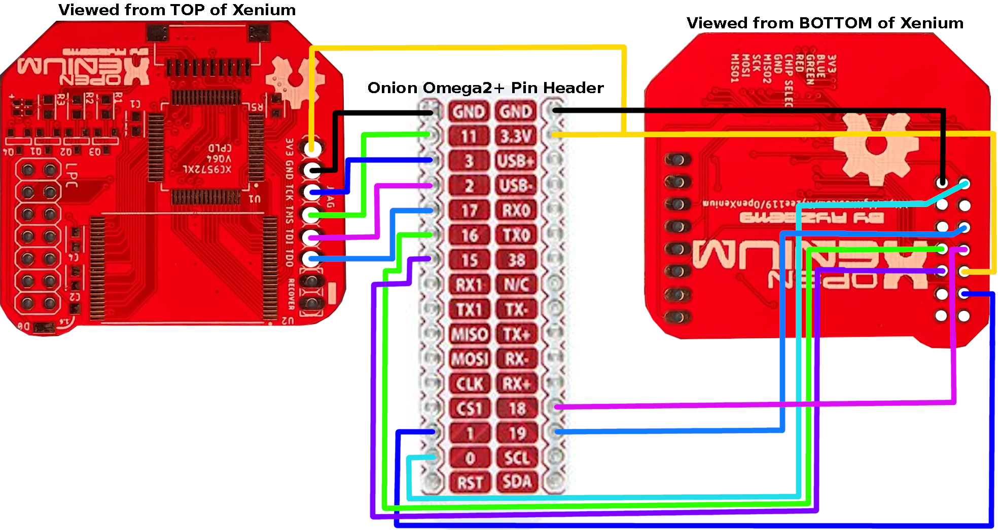
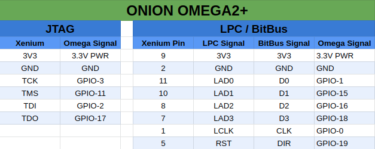

# OpenXenium JTAG and Flash Memory programmer

## * Read: ["Home Brew" on ORIGINAL XBOX](XBOX.md) - a detailed article on why and how *

The tools in this repo will allow you to use a Raspberry PI or an Onion Omega2+ to program an OpenXenium chip with the Xilinx CPLD Firmware via JTAG and will also upload XeniumOS images into the OpenXenium Flash memory via a custom 4-bit bus NOR Flash programming protocol. 

### Raspberry PI [UPDATED to support latest Raspberry PI OS (Bullseye)] :
- This has only been tested on PI Zero W and PI 3B+ model, but should work for all.

https://www.pishop.us/product/raspberry-pi-zero-w

https://www.pishop.us/product/raspberry-pi-zero-2-w

### Onion Omega2+:
- This has been tested and works on the Onion Omega2+.

https://Onion.io/store/omega2p

-------------
## INSTALLING THE XENIUM PROGRAMMER

- Connect to the PI or Omega via SSH or Serial terminal 
- Clone this repo by running: `git clone https://github.com/kooscode/xenium-programmer.git`
- Change Dir to cloned repo: `cd xenium-programmer`
- Then run: `./install`

## UPDATING XENIUM PROGRAMMER

- Connect to the PI or Omega via SSH or Serial terminal 
- Change dir to xenium-programmer and pull the latest code with: `git pull`
- Then run: `./install` 

-------------
## PROGRAMMING A XENIUM CPLD AND FLASH MEMORY

- Connect to the PI or Omega via SSH or Serial terminal 
- You can program XeniumOS and OpenXenium Firmware in one single step.
- Run: `./xenium-programmer`  

-------------
## HOOKING UP THE HARDWARE

- The JTAG and FLASH pins are configurable by editing the `XeniumDefines.h` file 
- If you edited the `XeniumDefines.h` file, make sure to run `./install` again

--------------
## [ RASPBERRY PI ]

### PC BOARD

Huge thanks to James Bolding for the Eagle PCB hardware design. He made a kick-ass Schematic and PCB that you can make for the Raspberry PI Zero based programmer!  

- You can use the FREE Eagle PCB to load this up or just use the gerber files to have the PCB made at OSH Park!

--------------
## [ ONION OMEGA2+ ]

-------------
## CREDITS

- Koos du Preez - Creator (kdupreez@hotmail.com - Comments, improvements, critique, etc. is welcome!)
- James Bolding - Kick ass awesome hardware design and PCB!
- Ryzee119 -  OpenXenium Firmware and hardware and all round awesomeness!
- XC3SPROG - Not sure who to thank here, but the source code was pivotal in making this work!
