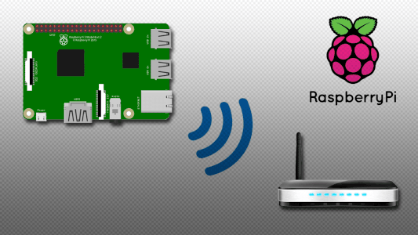
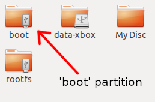

# Raspberry PI Scripts and Remote Access

If you dont have access to or dont want to use a keyboard, mouse and screen with your PI, you can use these scripts to get your PI to automatically boot with WIFI support and SSH turned on and access everything remotely via SSH. 

There are of course many ways to access your PI, this is a headless and remote way of doing it via wireless and provided here purely for convenience.

## Setup WIFI and SSH Access.

### Simply insert the PI's SD card into your computer and place these files in the 'boot' partition.

`ssh` - This will enable SSH when the PI boots.

`wpa_supplicant.conf` - Edit this file and fill in your WIFI SSID and Password to automatically connect to WIFI on boot.

## Connecting to the PI using SSH

After the PI boost up with the above files on the SD card, it will automatically move the network config file onto the file system and connect to WIFI, it wil allso remove the ssh file automatically and enable SSH.

- For a default or new PI setup, use any SSH tool and connect to `raspberrypi.local` with user `pi` and password `raspberry`
- If the MDNS name doesnt resolve, you might need to find your IP Address instead. Use Google for more details on that :)
- NOTE: It might take 5min for the initial load, wifi setup and mdns registration.. be patient.. 

### You should now be able to access your PI remotely via SSH and run the Xenium Flash tools